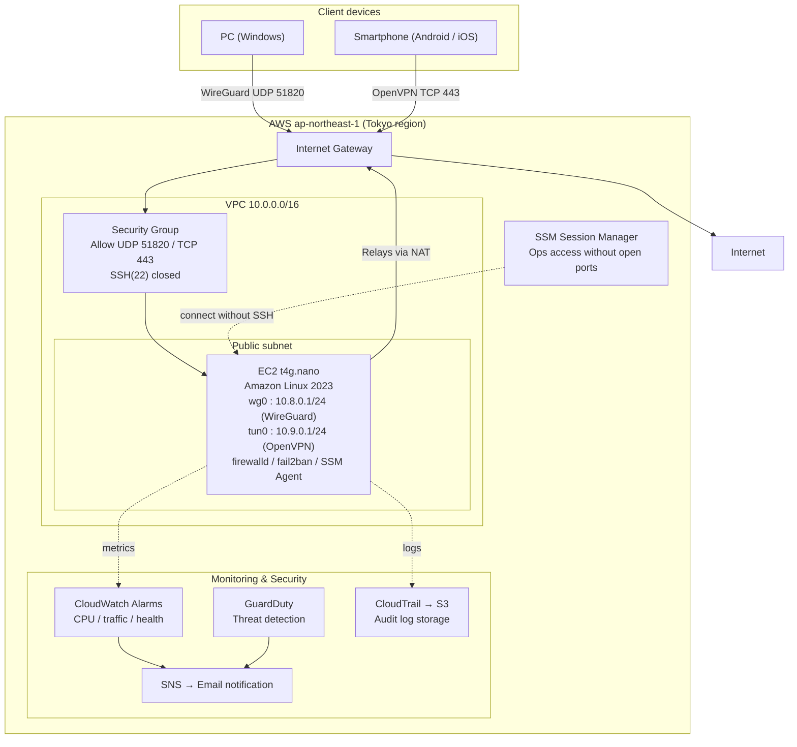
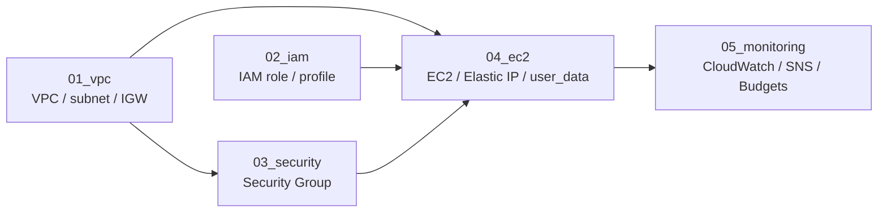
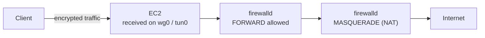

# Architecture Diagrams

> These diagrams are written in **Mermaid**. GitHub renders them automatically as diagrams, so no image files are needed (in a local editor you can preview them with a VS Code extension).

---

## 1. Overall Architecture

**Key points**

- All client traffic is aggregated at EC2, which relays it to the Internet on the client's behalf (full tunnel).
- WireGuard (UDP 51820) is used normally; where UDP is blocked, it falls back to OpenVPN (TCP 443).
- SSH(22) is never opened; operations go exclusively through SSM Session Manager.

---

## 2. CloudFormation Stack Layout (Dependencies)

**Key points**

- Split into 5 stacks so that "rebuild only EC2" or "change only the SG" can be done independently.
- Cross-stack values (VpcId, SubnetId, SecurityGroupId, etc.) are passed via `Outputs` → `Parameters`.

---

## 3. Traffic Flow (How a Packet Reaches the Internet)

**Key points**

- If `FORWARD` is not allowed, packets never reach `MASQUERADE`, so both must be configured.
- Amazon Linux 2023 uses firewalld's nftables backend, so `iptables -L` counters are not reliable indicators.
