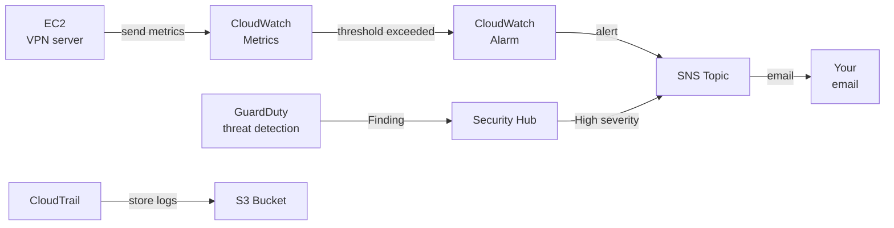

# Basic Design

**Project:** Personal VPN Server (CloudFormation edition)  
**Created:** 2026-05-31  
**Target environment:** AWS ap-northeast-1 (Tokyo region)

---

## 1. Design Principles

### 1.1 Core Concepts

| Principle | Approach | Rationale |
|-----|------|------|
| **Least privilege** | Grant only the required ports and permissions | Minimize security risk |
| **Infrastructure as Code** | Manage all resources with CloudFormation | Reproducibility, change tracking, prevention of manual errors |
| **No SSH** | Connect via SSM Session Manager | An exposed SSH port is a target for brute-force attacks |
| **Redundant protocols** | Both WireGuard and OpenVPN | Stay connectable even if one is blocked |
| **Cost optimization** | t4g.nano + Graviton2 (ARM) | Lower cost than equivalent x86 instances |

### 1.2 Threats in Scope

| Threat | Countermeasure |
|-----|------|
| Eavesdropping on public Wi-Fi | VPN encryption (WireGuard / OpenVPN) |
| Unauthorized access attempts to EC2 | fail2ban + Security Group (SSH port closed) |
| Unauthorized operations on the AWS account | CloudTrail (audit logs) + GuardDuty (threat detection) |
| Cost anomalies (overspend) | AWS Budgets (budget alerts) + CloudWatch |
| Anomalous traffic from malware | GuardDuty (VPC Flow Log analysis) + SNS notification |

---

## 2. Network Design

### 2.1 Why a Dedicated VPC

AWS provides a default VPC, but here a dedicated VPC is created.

**Reasons:**
- The default VPC has loose security settings (broad internet access) and is not recommended for production-style use.
- A dedicated VPC clearly isolates "this VPC is for the VPN only."
- It is good practice for learning network design.

### 2.2 Network Layout

```
VPC: 10.0.0.0/16 (65,536-address space)
└── Public subnet: 10.0.1.0/24 (256 addresses)
    └── EC2 instance (VPN server)
    └── Elastic IP (static public IP address)
```

| Resource | Value | Description |
|--------|-----|------|
| VPC CIDR | 10.0.0.0/16 | The whole VPC address space |
| Public subnet CIDR | 10.0.1.0/24 | Subnet hosting the EC2 |
| Availability Zone | ap-northeast-1a | A physical data center in Tokyo |
| Internet Gateway | 1 | The VPC's gateway to/from the internet |
| Route table | 1 | 0.0.0.0/0 → IGW |

### 2.3 Why Only a Public Subnet

This personal VPN uses a single (public) subnet.

**Difference from a typical production layout:**
```
Production (high availability):
  Public subnets × 3 (per AZ)  ← load balancer, bastion
  Private subnets × 3 (per AZ) ← app servers, DB

This project (personal VPN):
  Public subnet × 1 (1 AZ) ← VPN server only
  * Prioritizing cost and simplicity for personal use
```

### 2.4 VPN Internal Network

The private network after VPN connection:

| VPN protocol | Server IP | Client IP range |
|-------------|---------|----------------|
| WireGuard | 10.8.0.1 | 10.8.0.2–10.8.0.254 |
| OpenVPN | 10.9.0.1 | 10.9.0.2–10.9.0.254 |

---

## 3. Security Design

### 3.1 Security Group Rules

A Security Group is an "instance-level firewall" for EC2.

**Inbound (from outside to EC2):**

| Protocol | Port | Source | Reason |
|----------|------|--------|------|
| UDP | 51820 | 0.0.0.0/0 | WireGuard VPN (must be reachable from anywhere) |
| TCP | 443 | 0.0.0.0/0 | OpenVPN (same port as HTTPS; passes more easily) |
| ~~TCP~~ | ~~22~~ | ~~none~~ | **SSH not allowed** (replaced by SSM Session Manager) |

**Why the SSH port is not opened:**
```
If you expose SSH (port 22)...
  → Scanners worldwide probe port 22 around the clock
  → Once found, automated password brute-forcing begins
  → fail2ban helps, but fundamentally "not opening it" is best

With SSM Session Manager...
  → You connect to EC2 without opening any port
  → Secured by IAM authentication (MFA available)
  → Connection actions are recorded in CloudTrail
```

**Outbound (from EC2 to outside):**

| Protocol | Port | Destination | Reason |
|----------|------|--------|------|
| All | All | 0.0.0.0/0 | Allow all, to relay VPN client traffic |

**[Design decision] Why the inbound source IP is 0.0.0.0/0**

Setting the source of the VPN ports (UDP 51820 / TCP 443) to `0.0.0.0/0` (any IP) is a **deliberate design**.

```
Answering "why not restrict the IP?"

Purpose of a VPN = "connect securely from anywhere (travel, phone, hotel, etc.)"
            ↓
The source IP changes every time (home, cafe, mobile network, etc.)
            ↓
Restricting by IP would make the VPN itself unusable
```

Security is enforced by **cryptographic authentication**, not by IP restriction:

| Protocol | Authentication | Why it is safe without IP restriction |
|---|---|---|
| WireGuard | Public-key cryptography (Curve25519) | Without the correct client private key, no VPN session can be established. WireGuard also **does not respond at all** to unauthenticated packets (a port scanner sees a "nonexistent port") |
| OpenVPN | PKI certificate + TLS auth key (ta.key) | Without both the client certificate and ta.key, the connection is rejected at the TLS handshake stage |

> **Reference**: [Protocol & Cryptography - WireGuard](https://www.wireguard.com/protocol/)
>
> **Excerpt**
> "the server does not even respond at all to an unauthorized client; it is silent and invisible."

**Conclusion:** The 0.0.0.0/0 on the VPN endpoint is not a "forgotten restriction" — it is a deliberate decision combining the "connect from anywhere" requirement with a "protect via cryptographic authentication" policy. IP restriction is only useful when the source is limited to a fixed IP (e.g., a site-to-site VPN connecting from a specific location).

### 3.2 Host Firewall (firewalld)

In addition to the Security Group, EC2 runs its own firewall (defense in depth).

**Why the Security Group alone is not enough:**

A Security Group and an OS firewall differ fundamentally in what they can do.

| Capability | Security Group | OS firewall (firewalld) |
|---|---|---|
| Allow inbound on specific ports | ✅ | ✅ |
| Stateful (auto-allow return traffic) | ✅ | ✅ |
| Dynamic IP blocking via fail2ban | ❌ | ✅ |
| **MASQUERADE (source IP rewrite)** | ❌ **no** | ✅ |
| **FORWARD (inter-interface forwarding)** | ❌ **no** | ✅ |
| **Enable IP forwarding** | ❌ **no** | ✅ (sysctl) |

```
[Scope of the Security Group]
Internet ──→ [Security Group] ──→ EC2

The "front-door lock" of EC2. It only decides which ports/protocols
pass; it never touches packet contents (such as IP rewriting).

[Scope of the OS firewall (firewalld)]
Inside EC2: wg0 interface ──→ ens5 interface

The "internal plumbing" of EC2. It handles which interface to forward
a packet to, and what to rewrite the source IP to (NAT).
```

Running as a VPN server requires "forwarding received VPN packets to the internet and rewriting the source IP," which a Security Group cannot implement. The Security Group and the OS firewall are **complementary, not interchangeable**.

> **Reference**: [Amazon EC2 security groups](https://docs.aws.amazon.com/AWSEC2/latest/UserGuide/ec2-security-groups.html)
>
> **Excerpt**
> "If you have requirements that aren't fully met by security groups, you can maintain your own firewall on any of your instances in addition to using security groups."

**Summary of the division of roles:**

```bash
# firewalld configuration (set automatically by user_data.sh)
UDP 51820 → allow (WireGuard)
TCP 443   → allow (OpenVPN)
masquerade → enabled (rewrite VPN client source IP)
FORWARD   → enabled (allow wg0 → ens5 inter-interface forwarding)
```

---

### 3.3 How Linux Packet Filtering Works

#### INPUT / FORWARD / OUTPUT

In Linux packet filtering, the chain a packet traverses depends on "who the packet is for."

```
                     ┌─────────────────────────────────┐
                     │           EC2 (Linux)            │
                     │                                  │
External ─────────→  │  INPUT   ← packets destined      │
(UDP 51820, etc.)    │            for EC2 itself         │
                     │                                  │
                     │  OUTPUT  ← packets generated      │
                     │            by EC2 itself          │
                     │                                  │
VPN client           │  FORWARD ← packets just passing   │
 10.8.0.2 ──→ wg0   │            through EC2            │ ──→ Internet
                     │   ↑ this VPN forwarding is here   │  ens5
                     └─────────────────────────────────┘
```

| Chain | What passes through? | Concrete example here |
|---|---|---|
| **INPUT** | Packets received by EC2 itself | UDP 51820 (WireGuard connect), inbound SSM |
| **OUTPUT** | Packets sent out by EC2 itself | Traffic to SSM endpoints, NTP, DNS |
| **FORWARD** | Packets merely passing through EC2 | VPN client → internet relay |

The deciding factor is "**whether the packet's destination is EC2 itself**." The VPN client's destination is the internet, not EC2, so it goes through the FORWARD chain.

#### NAT vs IP Masquerade

iptables has multiple "tables," and chains exist across tables.

```
[filter table] ← decides whether to pass or drop
  ├─ INPUT chain
  ├─ FORWARD chain  ← allowed with --add-forward
  └─ OUTPUT chain

[nat table] ← rewrites IP addresses
  ├─ PREROUTING chain  (DNAT: rewrite destination IP)
  ├─ POSTROUTING chain ← MASQUERADE is here
  └─ OUTPUT chain
```

**NAT (Network Address Translation)** is the umbrella term for "rewriting IP addresses":
- **DNAT** (destination rewrite): change the destination IP of incoming packets (port forwarding, etc.)
- **SNAT** (source rewrite): rewrite the source IP to a fixed IP
- **MASQUERADE**: a special form of SNAT that **automatically** rewrites the source IP to "the current IP of the outgoing interface." It handles dynamically changing IPs well, which suits an EC2 with an Elastic IP

**Why "the nat table alone does not make MASQUERADE work":**

```
[Packet processing order]

Received on wg0 (from VPN client)
    │
    ▼
PREROUTING (nat table)
    │
    ▼
Routing decision: "destined for EC2 itself? or forwarded outside?"
    │
    ▼ forwarded outside
FORWARD chain (filter table) ← ★ if DROPped here, it goes no further!
    │
    ▼ only if allowed
POSTROUTING (nat table) ← MASQUERADE (IP rewrite) is here
    │
    ▼
Sent out via ens5 → Internet
```

MASQUERADE lives in the nat table's POSTROUTING, a **different table** from the filter table's FORWARD chain. If a packet is DROPped in FORWARD, it never reaches POSTROUTING, so MASQUERADE never runs no matter how it is configured.

In other words, both stages are required: "**FORWARD (decide to pass) → MASQUERADE (rewrite the IP)**."

---

### 3.4 fail2ban Configuration

| Setting | Value | Meaning |
|--------|-----|------|
| bantime | 3600 s (1 hour) | How long to ban |
| findtime | 600 s (10 min) | Within this window |
| maxretry | 3 | Ban after this many auth failures |
| Monitored log | /var/log/secure | AL2023's SSH auth log |

---

## 4. EC2 Design

### 4.1 Instance Type Selection

**Why t4g.nano:**

| Aspect | t4g.nano | t3.nano (reference) |
|-----|----------|--------------|
| Architecture | ARM (Graviton2) | x86-64 |
| vCPU | 2 | 2 |
| Memory | 0.5 GB | 0.5 GB |
| Monthly cost scale | **Very low** | Very low (pricier than t4g) |
| Cost comparison | **Lower cost with ARM (Graviton)** | — |
| VPN use | ◎ (ample for 1–3 personal users) | ◎ |

> **What t4g is:** t4g = t (burstable) + 4th generation + g (Graviton = ARM). An ARM-based instance family that can be used at lower cost than x86.

### 4.2 OS Selection (Amazon Linux 2023)

**Why Amazon Linux 2023 (AL2023):**

| Aspect | Amazon Linux 2023 | Ubuntu 24.04 |
|-----|------------------|-------------|
| Cost | **Free** | Free |
| AWS integration | **Best (first-party)** | Good |
| SSM Agent | **Pre-installed** | Needs install |
| Package management | dnf (RHEL family) | apt (Debian family) |
| Closeness to enterprise environments | Learn the RHEL family | — |
| Auto-fetch latest AMI | Native via CFn | Manual lookup needed |

**How AL2023's "auto-fetch latest AMI" works:**
```yaml
# Just writing this in CloudFormation fetches the latest AMI ID at deploy time
LatestAl2023AmiId:
  Type: AWS::SSM::Parameter::Value<AWS::EC2::Image::Id>
  Default: /aws/service/ami-amazon-linux-latest/al2023-ami-kernel-default-arm64
```
AMI IDs are updated periodically, but referencing this path always uses the latest.

### 4.3 EBS (Storage) Design

| Item | Value | Reason |
|-----|--------|------|
| Size | 20 GB | Enough for WireGuard + OpenVPN + logs |
| Type | gp3 | Latest-generation general-purpose SSD |
| Encryption | Enabled (AES256) | For data protection |
| Deletion policy | Deleted together with the instance | Fine for personal use |

---

## 5. VPN Design

### 5.0 Traffic Flow (How Routing Works) ★ Important

When using the VPN, traffic "always passes through the VPN server (EC2) before reaching the internet." The key point is that public Wi-Fi is "just a path that encrypted traffic passes through," not the destination.

```
[Traffic flow when connected to the VPN]

  Your PC / phone
    │  ① The VPN client on the device encrypts and tunnels ALL traffic
    ▼
  Public Wi-Fi (cafe, airport, etc. / untrusted path)
    │  ② Only an "encrypted blob" travels over the link.
    │     The cafe's Wi-Fi or an eavesdropper cannot read it (it just passes through)
    ▼
  EC2 (VPN server: inside AWS)
    │  ③ Here it is decrypted for the first time. EC2 acts "on your behalf"
    ▼
  Internet (websites, etc.)
       ④ EC2 makes the request and returns the response encrypted along the reverse path
```

**Key points:**
- The order is **"PC → (encrypted tunnel) → EC2 → internet"**, not "PC → internet → EC2." Device traffic is first aggregated at EC2, which then goes out on your behalf.
- As a result, the source IP that visited websites see is **EC2's Elastic IP**, not your home or public Wi-Fi IP. (Verified by confirming the global IP changes to EC2's after connecting.)
- Public Wi-Fi is an "untrusted path," but only encrypted data flows over it, so **it cannot be decrypted even if intercepted**. This is why the VPN keeps you safe.

**Why all traffic goes through EC2 (the AllowedIPs setting):**
- `AllowedIPs = 0.0.0.0/0` in the WireGuard client config means "send all destinations into the tunnel."
- This routes **all of the device's internet traffic** (not just specific sites) through EC2 (full-tunnel configuration).

### 5.1 Why Use Both WireGuard and OpenVPN

```
[Usage policy]
Normal: WireGuard (UDP 51820)
  → Fast and lightweight. Low latency thanks to UDP.

When UDP is blocked: OpenVPN (TCP 443)
  → Some corporate networks and countries block UDP
  → Uses TCP 443 (the HTTPS port), so it gets through in almost any environment
  → Slightly slower because it is TCP
```

### 5.2 Protocol Comparison

| Aspect | WireGuard | OpenVPN (TCP 443) |
|-----|-----------|------------------|
| Speed | **Fast** | Normal |
| Latency | **Low** | Somewhat higher |
| Configuration complexity | **Simple** | More involved (certificates needed) |
| Ease of passing firewalls | Harder (UDP may be blocked) | Better (TCP 443, same port as HTTPS) |
| Security | **Modern cryptography** | Proven track record |
| Phone setup | Easy via QR code | .ovpn file |

### 5.3 Comparison with AWS Managed VPN Services

AWS offers several managed services that provide VPN functionality. Here is why EC2 self-hosting was chosen.

#### AWS Managed Options

| Service | Main use | Billing model | Monthly cost scale |
|---|---|---|---|
| **AWS Client VPN** | Remote access from a personal PC → AWS VPC | Endpoint hourly charge + per-connection hourly charge | **High** |
| **AWS Site-to-Site VPN** | Site-to-site between an office ↔ AWS VPC | Per-tunnel hourly charge | **Medium** |
| **NAT Gateway** | Private subnet → internet | Hourly charge + data transfer | **Medium–High** |
| **This project (EC2 t4g.nano)** | Personal VPN server (WireGuard + OpenVPN) | Low-rate hourly charge only | **Very low** |

> **Relative cost scale:** Very low < Low < Medium < High.
> AWS pricing varies by time, region, usage, and conditions, so this document **states relative scale rather than asserting exact amounts**. Confirm the latest exact figures on each service's official pricing page (e.g., [AWS VPN Pricing](https://aws.amazon.com/vpn/pricing/)).

#### Cost Comparison

```
AWS Client VPN:    High (endpoint + per-connection charges run continuously)
EC2 self-hosted:   Very low (low-rate hourly charge only)
                   ─────────────
→ Self-hosting is dramatically cheaper (orders of magnitude apart)
```

AWS Client VPN is designed for enterprises managing many sites and users. Its pricing model does not fit personal use (1–3 client devices, a single user).

#### Feature Comparison

| Aspect | AWS Client VPN | EC2 self-hosted (this project) |
|---|---|---|
| VPN protocol | OpenVPN only (fixed) | **WireGuard + OpenVPN running together** |
| UDP/TCP switching | Limited | **Freely configurable** |
| Phone QR-code setup | Not supported | **Supported via the WireGuard app** |
| Operations | Handled by AWS (fully managed) | Self-managed (patching, etc.) |
| Configuration flexibility | Low (managed constraints) | **High (free configuration at the OS level)** |
| Incident response | Handled by AWS | Self-handled (investigate via SSM) |

#### Why EC2 Self-Hosting Fits Here

```
① Cost
   Compared to AWS Client VPN (cost scale: High), EC2 self-hosting (Very low) is
   dramatically cheaper. There is no need for an obviously over-spec managed service
   for personal use.

② Running WireGuard and OpenVPN in parallel
   AWS Client VPN supports only the OpenVPN protocol.
   The design of "fall back to OpenVPN on TCP 443 where UDP is blocked" cannot be
   achieved with the managed service.

③ Router functions (NAT/MASQUERADE/FORWARD)
   This VPN acts as a router that "relays client internet traffic via EC2."
   This OS-level packet forwarding control can only be configured on EC2; the
   managed service offers no equivalent.

④ Learning value
   Hands-on practice with the Linux network stack (iptables/firewalld), WireGuard's
   public-key cryptography, and IaC via CloudFormation.
```

**Conclusion:** AWS managed services are valuable for "lowering the management cost of many users," but for a personal VPN, EC2 self-hosting wins on cost, flexibility, and features.

---

## 6. IAM Design

### 6.1 IAM Role Attached to EC2

**Permissions (AmazonSSMManagedInstanceCore) — key actions (not exhaustive):**

| Allowed action | Purpose |
|-----------|------|
| ssm:DescribeAssociation | SSM checks EC2 configuration info |
| ssm:GetDocument | Retrieve SSM documents |
| ssmmessages:CreateControlChannel | Establish a session between SSM and EC2 |
| ec2messages:AcknowledgeMessage | Acknowledge receipt of SSM messages |
| s3:GetObject (SSM's S3 bucket only) | Update the SSM Agent |

No other permissions (e.g., full S3 access, operating other EC2 instances) are granted (least privilege).

---

## 7. Monitoring & Alerting Design

### 7.1 Monitoring Flow



### 7.2 Rationale for CloudWatch Alarm Thresholds

| Alarm | Threshold | Rationale |
|--------|------|------|
| CPU utilization | >85% for 5 minutes | A personal VPN is typically ~10–30%; 85% is clearly abnormal |
| Status check | 3 consecutive failures | Set to 3 in a row to exclude momentary blips |
| NetworkIn | >500 MB in 1 minute | Early detection of DDoS or anomalous traffic |

### 7.3 Role of Each Monitoring Service

| Service | What it monitors | What it tells you |
|--------|-------------|------------|
| **CloudTrail** | All AWS API operations | Who operated which resource and when |
| **GuardDuty** | CloudTrail + VPC Flow Logs + DNS | Suspicious network traffic, suspected credential compromise |
| **Security Hub** | Aggregates results from GuardDuty, etc. | Security score and overall security posture |
| **CloudWatch** | EC2 CPU, network, etc. | Server health |
| **Budgets** | Monthly charges | Early signs of cost overrun |
| **Compute Optimizer** | EC2 resource utilization | Instance type optimization suggestions |
| **Cost Optimization Hub** | Costs in general | Suggestions for where to save |

---

## 8. Cost Design

> **Note:** AWS pricing varies by time, region, usage, and free-tier availability, so this chapter **states the billing "mechanism" and a relative scale (Very low < Low < Medium < High) rather than asserting exact amounts**. Confirm actual figures on each service's official pricing page.

### 8.1 How the Billing Works

**EC2 (t4g.nano):**
- Usage-based: running time × hourly rate
- t4g.nano is a lowest-tier, low-rate instance
- Even running 24/7/365, the monthly cost scale is **Very low**

**Elastic IP (public IPv4):**
- Since February 2024, AWS charges hourly for **all public IPv4 addresses, whether in use or not**. An EIP associated with a running EC2 is billable, as is an unused EIP (the old "free while associated" no longer applies).
- Mitigation: do not keep spare EIPs (release ones you do not use). This setup uses exactly one at all times.
- * Rates and free tiers change, so confirm exact figures on the official pricing page.

**Data transfer:**
- EC2 to internet: usage-based charge by data volume (free tier available)
- For a personal VPN (a few tens of GB/month), the cost scale is **Low**

**GuardDuty (after the 30-day free period):**
- Usage-based charge for CloudTrail event analysis and VPC Flow Log analysis
- For a personal VPN, the cost scale is **Low**
