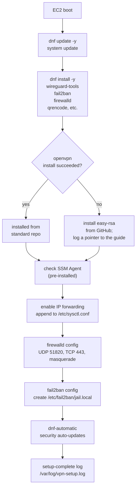
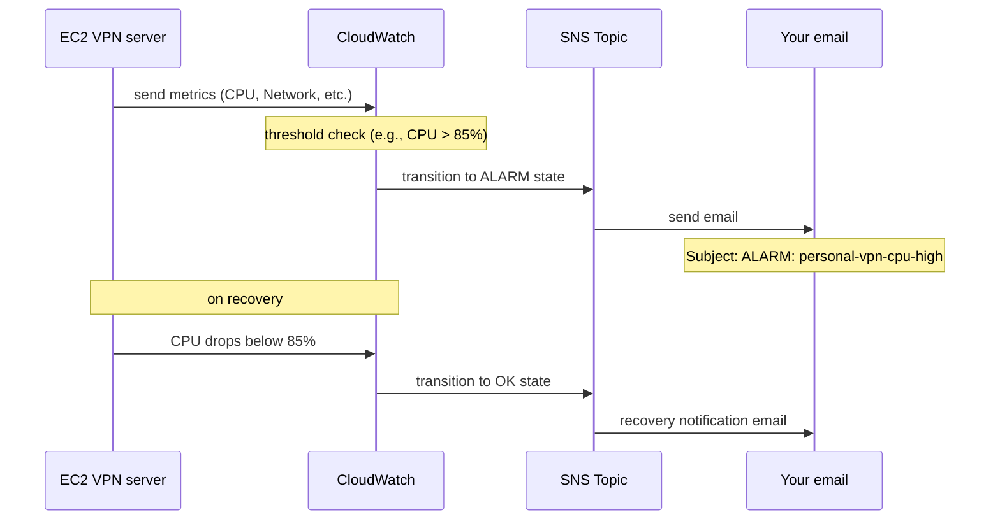
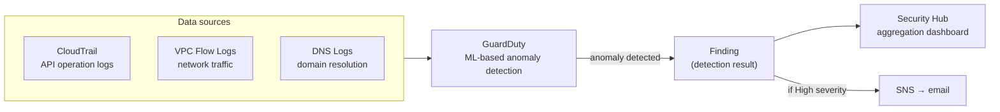

# Detailed Design

**Project:** Personal VPN Server (CloudFormation edition)  
**Created:** 2026-05-31

---

## 1. CloudFormation Stack Details

### Stack List and Dependencies

```
① personal-vpn-vpc-stack (01_vpc.yaml)
   └── Outputs: VpcId, PublicSubnetId, VpcCidr

② personal-vpn-iam-stack (02_iam.yaml)  ← can deploy in parallel with ①
   └── Outputs: InstanceProfileName, RoleArn

③ personal-vpn-security-stack (03_security.yaml)  ← after ①
   └── Inputs: VpcId (output of ①)
   └── Outputs: SecurityGroupId

④ personal-vpn-ec2-stack (04_ec2.yaml)  ← after ② and ③
   └── Inputs: SubnetId (output of ①), SecurityGroupId (output of ③), InstanceProfileName (output of ②)
   └── Outputs: InstanceId, PublicIp, PrivateIp

⑤ personal-vpn-monitoring-stack (05_monitoring.yaml)  ← after ④
   └── Inputs: AlertEmail (email address), InstanceId (output of ④), MonthlyBudgetUSD (default 20)
   └── Outputs: AlarmTopicArn, CloudTrailName, GuardDutyDetectorId
```

---

## 2. Per-Stack Resource Details

### 2.1 VPC Stack (01_vpc.yaml)

| Resource type | Logical ID | Settings |
|-------------|-------|--------|
| AWS::EC2::VPC | VPC | CIDR: 10.0.0.0/16, DNS enabled |
| AWS::EC2::InternetGateway | InternetGateway | — |
| AWS::EC2::VPCGatewayAttachment | IGWAttachment | Attach VPC + IGW |
| AWS::EC2::Subnet | PublicSubnet | CIDR: 10.0.1.0/24, AZ: ap-northeast-1a |
| AWS::EC2::RouteTable | PublicRouteTable | — |
| AWS::EC2::Route | PublicRoute | 0.0.0.0/0 → IGW |
| AWS::EC2::SubnetRouteTableAssociation | SubnetRouteTableAssociation | Associate subnet with route table |

**Parameters:**

| Parameter | Default | Changeable |
|-----------|----------|---------|
| ProjectName | personal-vpn | Yes (keep consistent across all stacks) |
| VpcCidr | 10.0.0.0/16 | Yes |
| PublicSubnetCidr | 10.0.1.0/24 | Yes |
| AvailabilityZone | ap-northeast-1a | Choose from a/c/d |

### 2.2 IAM Stack (02_iam.yaml)

| Resource type | Logical ID | Settings |
|-------------|-------|--------|
| AWS::IAM::Role | EC2SSMRole | Trust: ec2.amazonaws.com, Policy: AmazonSSMManagedInstanceCore |
| AWS::IAM::InstanceProfile | EC2InstanceProfile | Roles: EC2SSMRole |

**Key permissions in AmazonSSMManagedInstanceCore (subset):**

```json
{
  "ssm:DescribeAssociation",
  "ssm:GetDocument",
  "ssm:ListAssociations",
  "ssmmessages:CreateControlChannel",
  "ssmmessages:CreateDataChannel",
  "ssmmessages:OpenControlChannel",
  "ec2messages:AcknowledgeMessage",
  "ec2messages:GetMessages",
  "ec2messages:SendReply"
}
```

### 2.3 Security Group Stack (03_security.yaml)

| Resource type | Logical ID | Settings |
|-------------|-------|--------|
| AWS::EC2::SecurityGroup | VpnSecurityGroup | See below |

**Security group rule details:**

Inbound (only allow rules; everything else denied by default):

| # | Protocol | Port | Source | Use |
|---|---------|------|--------|------|
| 1 | UDP | 51820 | 0.0.0.0/0 | WireGuard (IPv4) |
| 2 | TCP | 443 | 0.0.0.0/0 | OpenVPN (IPv4) |
| 3 | UDP | 51820 | ::/0 | WireGuard (IPv6) |
| 4 | TCP | 443 | ::/0 | OpenVPN (IPv6) |

Outbound (allow all):

| # | Protocol | Port | Destination | Use |
|---|---------|------|--------|------|
| 1 | -1 (all) | All | 0.0.0.0/0 | VPN traffic relay (IPv4) |
| 2 | -1 (all) | All | ::/0 | VPN traffic relay (IPv6) |

### 2.4 EC2 Stack (04_ec2.yaml)

| Resource type | Logical ID | Settings |
|-------------|-------|--------|
| AWS::EC2::Instance | VpnServer | AL2023 ARM64, t4g.nano |
| AWS::EC2::EIP | ElasticIP | Domain: vpc |
| AWS::EC2::EIPAssociation | EIPAssociation | Associate instance + EIP |

**EC2 instance details:**

| Setting | Value | Description |
|--------|-----|------|
| AMI | Auto-fetch (SSM Parameter Store) | Latest AL2023 ARM64 |
| Instance type | t4g.nano | 2 vCPU, 0.5 GB RAM, ARM |
| EBS size | 20 GB | Root volume |
| EBS type | gp3 | Latest-generation SSD |
| EBS encryption | Enabled (AES256) | Data protection |
| Auto-assign public IP | Disabled | Managed via Elastic IP |
| UserData | See below | Auto-setup at first boot |

**How auto-fetch AMI works:**

```yaml
# Auto-fetch using CloudFormation's SSM parameter type
LatestAl2023AmiId:
  Type: AWS::SSM::Parameter::Value<AWS::EC2::Image::Id>
  Default: /aws/service/ami-amazon-linux-latest/al2023-ami-kernel-default-arm64

# This path holds the latest AL2023 ARM64 AMI ID managed by AWS.
# The latest ID is fetched automatically at stack deploy time.
# No manual AMI ID lookup is needed.
```

### 2.5 Monitoring Stack (05_monitoring.yaml)

| Resource type | Logical ID | Settings |
|-------------|-------|--------|
| AWS::SNS::Topic | AlarmTopic | Notification relay |
| AWS::SNS::Subscription | AlarmTopicSubscription | Email subscription |
| AWS::S3::Bucket | CloudTrailBucket | CloudTrail log storage (90-day retention) |
| AWS::S3::BucketPolicy | CloudTrailBucketPolicy | Allow CloudTrail writes |
| AWS::CloudTrail::Trail | CloudTrail | Management event logging |
| AWS::GuardDuty::Detector | GuardDutyDetector | Threat detection (new findings near real-time; recurring occurrences aggregated every 6 hours) |
| AWS::SecurityHub::Hub | SecurityHub | Security aggregation |
| AWS::CloudWatch::Alarm | CPUUtilizationAlarm | CPU > 85% (5 min) |
| AWS::CloudWatch::Alarm | StatusCheckAlarm | Status check failure |
| AWS::CloudWatch::Alarm | NetworkInAlarm | NetworkIn > 500 MB/min |
| AWS::Budgets::Budget | MonthlyBudget | Monthly budget cap (set via the `MonthlyBudgetUSD` parameter) |

---

## 3. IP Address Design

| Network | CIDR | Use |
|-----------|------|------|
| VPC | 10.0.0.0/16 | The AWS private network |
| Public subnet | 10.0.1.0/24 | EC2 placement |
| WireGuard internal | 10.8.0.0/24 | Inside the VPN tunnel |
| OpenVPN internal | 10.9.0.0/24 | Inside the VPN tunnel |

**IP assignments:**

| Role | IP address |
|-----|---------|
| EC2 private IP | 10.0.1.x (auto-assigned by AWS) |
| EC2 public IP | Elastic IP value (confirmed after deploy) |
| WireGuard server | 10.8.0.1 |
| WireGuard client #1 | 10.8.0.2 |
| WireGuard client #2+ | 10.8.0.3+ |
| OpenVPN server | 10.9.0.1 |
| OpenVPN client | 10.9.0.x (auto-assigned by DHCP) |

---

## 4. user_data.sh Processing Details

At first boot, execution logs are written to `/var/log/cloud-init-output.log`.

### Processing Flow



### Step Details

| Step | Command summary | Purpose |
|--------|----------|------|
| 1 | `dnf update -y` | Update OS packages (apply security patches) |
| 2 | `dnf install -y wireguard-tools...` | Install VPN / security tools |
| 3 | `systemctl enable --now amazon-ssm-agent` | Confirm SSM Agent is running (pre-installed) |
| 4 | Append to `/etc/sysctl.conf` → `sysctl -p` | Enable IP forwarding (packet forwarding) |
| 5 | `firewall-cmd --permanent ...` | Open WireGuard/OpenVPN ports + NAT masquerade |
| 6 | Create `/etc/fail2ban/jail.local` | Configure brute-force protection |
| 7 | Configure `dnf-automatic` | Auto-apply security updates |

---

## 5. CloudTrail S3 Bucket Policy

For CloudTrail to write logs to S3, the bucket needs the following policy.

```json
{
  "Statement": [
    {
      "Sid": "AWSCloudTrailAclCheck",
      "Effect": "Allow",
      "Principal": {"Service": "cloudtrail.amazonaws.com"},
      "Action": "s3:GetBucketAcl",
      "Resource": "arn:aws:s3:::BUCKET_NAME"
    },
    {
      "Sid": "AWSCloudTrailWrite",
      "Effect": "Allow",
      "Principal": {"Service": "cloudtrail.amazonaws.com"},
      "Action": "s3:PutObject",
      "Resource": "arn:aws:s3:::BUCKET_NAME/AWSLogs/ACCOUNT_ID/*",
      "Condition": {
        "StringEquals": {"s3:x-amz-acl": "bucket-owner-full-control"}
      }
    }
  ]
}
```

**Why this is needed:**
- By default, S3 disallows writes from anyone but the owner.
- The CloudTrail service is a separate entity ("cloudtrail.amazonaws.com").
- This policy explicitly grants "writes from the CloudTrail service."

---

## 6. SNS Notification Flow



**Important:** After the stack deploys, SNS sends a subscription confirmation email. Notifications will not arrive unless you click the **"Confirm subscription"** link.

---

## 7. GuardDuty Detection Flow



**Examples of threats GuardDuty detects:**

| Finding type | Description |
|----------|------|
| UnauthorizedAccess:EC2/SSHBruteForce | Brute-force attack against SSH |
| Backdoor:EC2/C&CActivity | Communication to a malware C2 server |
| UnauthorizedAccess:IAMUser/ConsoleLoginSuccess | Login from an unusual IP |
| Recon:EC2/PortProbeUnprotectedPort | Port-scan detection |

---

## 8. Budgets Notification

> Thresholds fire not on a fixed amount but on a **percentage of the monthly budget** set via the `MonthlyBudgetUSD` parameter. The operator sets the actual amount.

| Trigger | Threshold | Notification |
|-----------|-----|---------|
| Actual cost reaches 80% of budget | Budget × 80% | Email |
| Actual cost reaches 100% of budget | Budget × 100% | Email |
| Forecast cost expected to exceed budget | Expected to exceed the budget | Email (early mid-month warning) |

> **How forecast notification works:** AWS predicts the month-end bill from the current usage pace and notifies you in advance if an overrun is expected. This catches a sudden mid-month cost spike early.
